# Laboratoria Social Media App #

* **Track:** _Retos_
* **Curso:** _Crea tu propia red social_
* **Unidad:** _Crea tu propia red social_

***

## Objetivo

   Aplicación móvil que acerca al público en general al arte. Buscando tres interacciones

 *  exhibir arte
 *  comprar arte
 *  aprender arte

## Análisis del usuario

 VISIÓN DEL MERCADO GLOBAL

  Las aplicaciones móviles van cobrando cada vez más protagonismo frente a la navegación en web desde PC o móviles. Pero este protagonismo no se refiere solo a la navegación sino, también, a los ingresos que genera la publicidad in-app. A medida que los anunciantes son más conscientes de los resultados, están re-asignando sus presupuestos en favor de las apps en busca del máximo retorno. Pero ésta no es la única razón: cada vez hay más usuarios que adoptan más dispositivos móviles y cada nuevo dispositivo representa una nueva oportunidad para generar ingresos. Esto es: el crecimiento de la adopción de dispositivos tiene un impacto directo en el crecimiento de la oportunidad de monetización.

  En función del objetivo que cada desarrollador se haya marcado, se suele elegir el modelo de negocio más adecuado. Precisamente el modelo de negocio, junto a la elección adecuada del target, son factores esenciales para el éxito de una aplicación. Los modelos de negocio de las apps en los que suelen trabajar los desarrolladores son:

   * Free: todo gratis (no hay pago por descarga y todas las funcionalidades están disponibles. Suele tener como objetivo branding o generación de bases de usuarios).
   *	Freemium: descarga gratis con compras dentro de la aplicación.
   *	Paid: pago por descarga pero no hay compras in-app.
   *	Paidmium: pago por descarga y con compras in-app.
   *	In-App Advertising: App gratis que contiene publicidad (banners, vídeo…).
   *	Dynamic: modelo de negocio que cambia en función de una serie de factores (por ejemplo, la app puede cambiar y pasar de ser 100% gratuita a incluir publicidad en el caso de que el usuario no realice ninguna compra in-app).

 En el ecosistema móvil, las aplicaciones representan actualmente la segunda mayor fuente de ingresos por detrás del consumo de datos, tanto por pago de contenidos como por publicidad. El informe muestra que entre agosto y septiembre las descargas de aplicaciones móviles en las tiendas iOS y Google Play llegaron a 26.000 millones en todo el mundo, lo que supone un crecimiento del 8%. En términos de ingresos los resultados también fueron muy positivos para el mercado de aplicaciones, ya que en el tercer trimestre del año alcanzaron los US$17.000 millones, lo que representa un crecimiento anual del 28%.

 Además, destaca que el tiempo dedicado a las aplicaciones móviles también crece. En el caso de los teléfonos con el sistema operativo Android creció un 40% año contra año, acercándose a las 325.000 millones de horas en el tercer trimestre de 2017.
   “El crecimiento en términos de descargas y uso, demuestra que las aplicaciones se están convirtiendo cada vez más en el centro de la vida de las personas. Este valor se está traduciendo en un aumento de los ingresos para la industria”, dice el informe.

  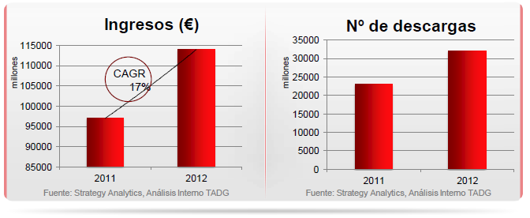

  SMARTPHONES

  El reporte dice que, al igual que en trimestre anteriores, Google Play mantuvo una ventaja sobre iOS en descargas.

  La brecha entre ambas plataformas se amplió a 125% en el tercer trimestre de este año frente al 115% registrado en el mismo período de 2016. Dicho resultado responde, en parte, a la dinámica de los mercados emergentes.

  Las ventas de smartphones de plataforma Android alcanzarán en 2013 los 1.000 millones de dispositivos mientras que iOS habrá vendido 527 millones de smartphones para finales de 2013.

 La investigación concluye que el mercado de aplicaciones llegará a 240.000 millones de descargas, a la vez que sus ingresos llegarán a los US$100.000 millones en el año 2021 en iOS y Google Play en conjunto.

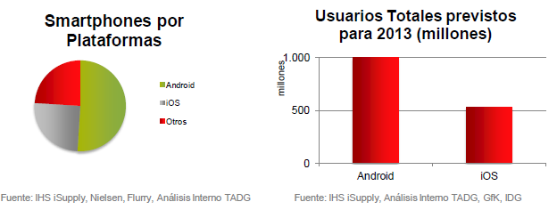

 REDES SOCIALES

 Los teléfonos inteligentes y las aplicaciones móviles son una parte esencial de la vida de los seres humanos.
 De acuerdo al reporte IMS Mobile in LatAm Study, Colombia es el país en donde más se consume internet a través de teléfonos inteligentes entre los países latinoamericanos evaluados con 12,2 horas por semana online.

 Las cifras de Colombia son superiores a las registradas en países como Brasil (11,8 horas en promedio a la semana); México (10,1); Argentina (9,8); Perú (9,2) o Chile (11,6).

 Por otro lado, un informe de la compañía latinoamericana de tecnología Lanix reveló que el consumo de aplicaciones se ha disparado entre los consumidores Mexicanos.
   “En el mercado existen innumerables aplicaciones, pero unas de las más usadas son las de mensajería instantánea que hacen posible que el consumidor se mantenga comunicado con el mundo”.

 De hecho, el 84% de los encuestados asegura que utiliza frecuentemente  Whatsapp, seguido de Facebook Messenger con el 9%, Facebook Messenger Lite con el 4%, Skype con el 2% y Telegram con el 1%.

 Teniendo en cuenta estos indicadores, la investigación concluye que “los consumidores han ido adquiriendo patrones de comportamientos con el paso de los años y el de ahora los obliga a usar aunque sea una aplicación para estar en contacto con el mundo”.

 La firma especializada en estadísticas de mercado Statista ha realizado una reciente investigación en la cual revela que solo en Estados Unidos los medios sociales alcanzarán los US$17.800 millones por concepto de publicidad al cierre de 2017.

## A R T E

 La Encuesta Nacional de Hábitos, Prácticas y Consumo Culturales (CNCA): nos  dice que un 48% de mexicanos no muestran interés por la cultura. El estudio costó más de 7 millones de pesos y estuvo a cargo de una empresa privada. Más que la carencia preocupa la equidad, pues hay lugares sin ninguna actividad artística, señala experto.

 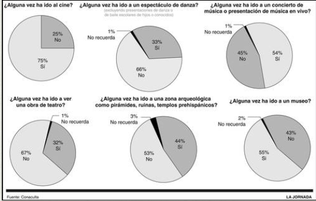

 La ENCCUM también tuvo como objetivo captar la población que utiliza Internet, así como las ocasiones y la proporción del consumo de este servicio asociado con actividades susceptibles de ser consideradas parte del sector cultural. El uso de internet por motivos culturales incluye las actividades de comprar libros y revistas; comprar CD, música, DVD y software; ver videos, películas o programas de TV; oír música grabada, radio o audiolibros; leer periódicos, revistas o libros; descargar libros, revistas o artículos académicos; descargar música o video; y descargar software. En este sentido, se encontró que el 46% de la población del país con seis o más años navegó en Internet por motivos culturales al menos en una ocasión durante el año 2014.

  En los resultados presentados por grupos de edad, se desprende que las personas cuyo rango de edad oscila entre los 18 y 29 años navegaron en Internet por motivos de conocimiento/culturales y que realizaron este tipo de actividades en al menos en una ocasión. Las personas con edades entre los 30 y 49 años de edad, representan  el 26%; en tercer lugar le siguen las personas con edades entre los 12 y 17 años de edad, con el 21%; y finalmente, quienes menos navegaron fueron aquellas personas con edades entre los 6 y 11 años y aquellas con edades de 50 y más años, quienes representaron el 12% destaca que el universo de personas con edades entre los 12 y 17 años usuaron Internet por motivos netamente culturales, pues
  con el fin de acercarse a la oferta cultural. Al presentar los resultados por nivel educativo la mayiría de la población que navegó en Internet por tenía estudios de nivel básico, aquellas con estudios de nivel medio representaron el 30% mientras que las de nivel medio superior el 28%. En lo que respecta al número de ocasiones (no por motivos culturales), éstas  indican que el mayor número fueron realizadas por los hombres, con el 55%, mientras que las mujeres realizaron el 45% restante.

  TENDENCIAS EN NÚMERO DE DESCARGAS

   *	En 2017, se descargaron 175,000 millones de apps en todo el mundo, un aumento del 60 por ciento desde 2015. Esa cifra equivale a dos apps al mes por usuario.

   *	Los consumidores gastaron US$86,000 millones en las tiendas de apps el año pasado, un alza del 105 por ciento en dos años.

   *	El uso de apps a nivel global aumentó un 60 por ciento en 2017, frente a 2015.

   *	La cantidad de tiempo que se pasan los usuarios usando sus apps se disparó un 30 por ciento en dos años.

   * En total, cada usuario pasa 43 días al año usando sus apps; eso se traduce en tres horas al día por persona.

   *	El usuario promedio tiene 80 apps en su celular y usa la mitad de ellos cada mes.

   *	Mas del 81 por ciento de usuarios en el 2017 prefirieron usar el app nativo de una empresa que un navegador móvil para entrar al sitio Web de dicha compañía.

   *	Uno de cada US$4 generados por las tiendas de apps (Apple App Store, Google Play y otras tiendas Android) proviene de los consumidores chinos.

   *	Las personas en la India descargan más apps que los estadounidenses. El país número uno en descargas es China.

   *	El uso de apps de instituciones financieras o para hacer transacciones de dinero creció más del 50 por ciento en EE.UU. y España entre 2015 y 2017. En Brasil, esta cifra se duplicó con creces.

   *	En EE.UU., el número de sesiones de compras por el app de una minorista o una tienda digital de comercio aumentó un 70 por ciento entre 2015 y 2017.

PANORAMA DE LAS APPS DE INTERACCIÓN SOCIAL Y ARTE ¿QUIÉN ES QUIÉN? TOP 5 DE LAS APPS EN MÉXICO.

 WYRD

 Similar a la forma con la que eliges una pareja en Tinder(un swipe hacia la izquierda y otro para la derecha), en Wydrpuedes destacar las obras de arte que más te gusten.

 La idea es que, sin presiones, tú selecciones aquellas piezas (creadas por artistas emergentes) que llamen tu atención. Y después, si te animas, las adquieras y comiences una colección; o bien, sólo las tengas reunidas en la carpeta "My gallery" para que las veas cuantas veces quieras.

 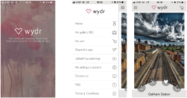

 Google Arts & Culture

 ¿Imaginas poder acceder a más de mil museos de todo el mundo con un solo clic?

 Con la app que desarrolló Google puedes hacer eso y más. Por ejemplo: observar exposiciones en línea; curiosear en las colecciones de museos de 70 países;  "ver de cerca" algunas obras famosas de la historia, desde el 200 a.C., hasta la actualidad; e incluso visitar importantes recintos culturales con street view.

 Tienes mucho para explorar. Para que no te hagas bolas, tu búsqueda la puedes definir por socios (museos), proyectos, artistas, técnicas, movimientos artísticos, sucesos o personajes históricos, y lugares.
 Disponible para los sistemas operativos iOS y Android.

 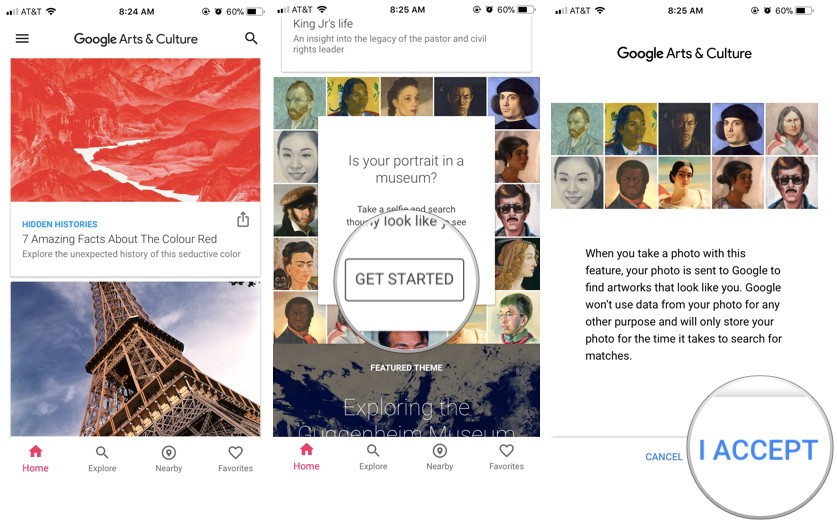

 DailyArt

 Esta app te muestra cada día una obra diferente. ¿Cómo funciona? Te envía una notificación a tu celular; una vez que la abres, te da detalles tanto de la pieza (medidas, la colección a la que pertenece y la técnica) como del autor.

 Si te gustó mucho tu “dosis de arte” puedes compartirla a través de redes sociales, vía email o directamente desde la aplicación.

 Disponible para los sistemas operativos iOS y Android.

 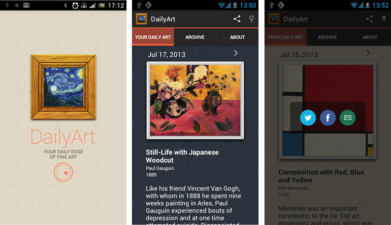

 Famous Painters & Paintings

 Caravaggio, Diego Velázquez, Leonardo da Vinci, Claude Monet, Rubens, van Gogh y otros pintores famosos componen el catálogo de esta mini app.

 Con Famous Painters & Paintings conocerás de manera breve los datos más relevantes de cada artista, así como sus obras más emblemáticas.

 Disponible para sistema operativo Android.

 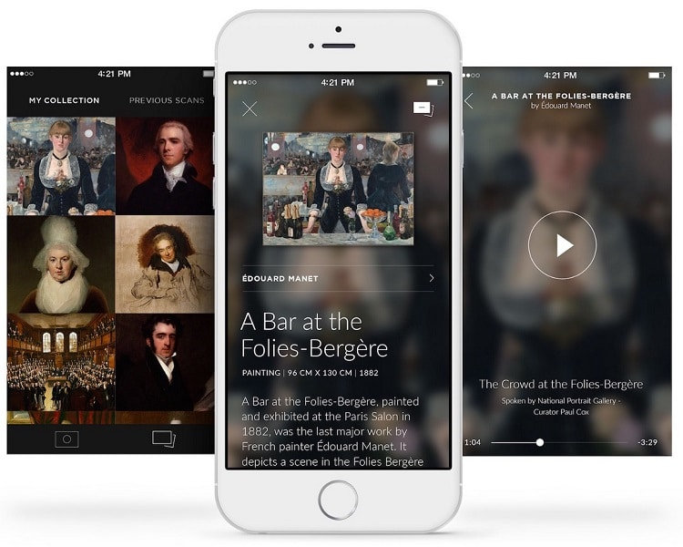

 Cultura UNAM

 Esta aplicación te permite escuchar, descargar y disfrutar los contenidos de Descarga Cultura.UNAM, el sitio de podcasts que te ofrece la Universidad Nacional Autónoma de México a través de su Coordinación de Difusión Cultural. En este sitio de podcasts, y ahora a través de esta práctica e innovadora aplicación, encontrarás una gran variedad de literatura en formato de audio, cuya lectura podrás escuchar mientras te transportas de un sitio a otro, realizas algún ejercicio o simplemente te das una pausa para disfrutar: cuento, novela corta, poesía, ensayo, crónica y teatro. Los materiales han sido grabados por lectores profesionales y, mejor aún, por sus propios autores. De esta manera disfrutarás piezas literarias, tanto nacionales como extranjeras, clásicas y contemporáneas. También encontrarás música producida por nuestra Universidad Nacional, conferencias, material de divulgación de la ciencia, cursos y mucho más.

 Este es un servicio de extensión universitaria gratuito y de acceso universal.

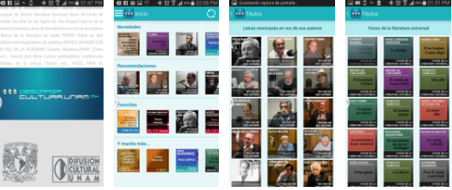

 SISTEMA OPERATIVO

   * Ambos sistemas operativos comparten las apps más populares de arte.

   * La principal diferencia viene marcada por las diferencias en el perfil del usuario.

   * Las apps del usuario de iOS expresan un mayor poder adquisitivo, formación, cultura viajera y capacidad de segmentación por intereses.

ANALÍSIS DE APP AFFORABLE

 En base a nuestro estudio de mercado, la demanda de Apps es un mercado creciente para la población que cuenta con el acceso a un teléfono móvil e internet, no solo en el país sino en el mundo.

 Es decir los usuarios adoptan más dispositivos móviles dejando de lado los procesadores, dándonos el poder de estar en constante movimiento sincontar con esta limitación de las pc, además del costo menor que estos traen consigo.

 Por ello, cada nuevo dispositivo representa una nueva oportunidad para generar ingresos. Y el hecho de que “los consumidores han ido adquiriendo patrones de comportamientos con el paso de los años y el de ahora los obliga a usar aunque sea una aplicación para estar en contacto con el mundo”. Tomamos estas dos necesidades para apoyar la comercialización, distribución, apreciación y generar vínculos de comunicación entre este sector social. Es decir, tomamos este auge de redes sociales como un factor determinante para incluir el arte en la vida social de las personas que accedan a esta App.

 A F F O R A B L E

 Afforable te permite acercar al público al arte e incentivar a la creación artística, a través de workshops y streaming’s dentro de la app. Puedes generar tu galería virtual dentro de tu perfil, de forma similar a Instagram, dar like, comentar, enviar mensajes, seguir personas y estar al tanto de sus obras para comprar si estás interesado en comenzar una colección.

 MARCA

 CONTENIDO/ FUNCIONALIDADES

 El contenido gratuito consiste en las imágenes de las obras que la comunidad suba a la app. Cada una de estas imágenes ofrece información acerca de su elaboración. El menú de la app tiene 4 pestañas:

  * Inicio: contiene las fotografías de obras subidas más recientes, con botones de me gusta y posibilidad de comentar.

  * Compra: muestra un carrito donde puedes comprar la obra de tu interés.

  * Workshop: permite al usuario realizar un taller de cualquier actividad que se encuentre disponible, mostrar su progreso y marcar esa actividad como favorito.

  * Favoritos: permite al usuario guardar sus imágenes e ir haciendo su colección virtual sin comprar obra.

  MODELO DE NEGOCIO

 El modelo de negocio es freemium. La descarga de la app matriz es gratuita. Ofrece contenidos ilimitados de las obras y workshops. El usuario accede a los workshops especializados a través del pago vía in-app purchase. El precio de las obras depende de su categoría:

 * Obras de pequeño formato : $650 MXN
 * Obras de mediano formato: $1,000 MXN
 * Obras de gran formato: $1,350 MXN
 * workshops especializados: $400 MXN

## C O N C L U S I O N E S

  Revolución App: Revolución del arte

   * Las apps han transformado la relación de los usuarios con internet. El consumo y el ocio se han colado en nuestro bolsillo y la revolución de las apps ha entrado de pleno en la industria del mercado.

   * El ordenador ha quedado en un segundo plano y las apps como herramientas del usuario se imponen.

   * Esta revolución tecnológica ha transformado la forma de consumir, en este caso arte – cultura, es por ello que lo ponemos al alcance de cualquier usuario, ya que como pudimos observar uno de los puntos clave del consumo de cultura en el país es el acceso al mismo.

   * 6 de cada tres personas no han asistido a un museo.

   * El café lo pago con el móvil. Se observa una tendencia muy fuerte hacia el pago con móvil para las pequeñas transacciones desde el taxi al restaurante, es por ello que ¿por qué no, comprar arte?

   * Salir de la ciudad. No existe la necesidad de traslado del usuario para realizar la compra o visualizar arte, conocer artistas e interactuar en esta comunidad.

   * Conocer y jugar. La experiencia de la app gana una nueva dimensión a través del juego. La gamificación en las apps es un éxito en las apps de adultos y puede abrir un nuevo camino de apps de arte y cultura en versiones complementarias para adulto y niño.

   * Los datos los generamos todos. La generación de datos entre usuarios como la popular Waze dibuja un usuario que informa a otros usuarios. El estado de una obra, una cola en un museo, el número de personas alrededor de un monumento...

   * Arte para minorías es posible y genera oportunidad. Las aplicaciones satisfacen de una manera eficiente al usuario con intereses concretos, un tipo de persona que tiende a quedarse más satisfecho con la acogida digital.

   * La promoción, un básico para la buena acogida con apps. Los “heavy users”, al saber cómo moverse y elegir bien entre la jungla de apps, tienden a quedar más satisfechos con el uso de una app.

## Usabilidad / Diseño

 Los “feos” también triunfan… Un diseño impecable no es una condición necesaria para que la aplicación sea un éxito en descargas pero una correcta usabilidad es imprescindible. .

 Pero las apps atractivas gustan más. Como demuestra el caso de Afforable, la estética combinada con la usabilidad e integración con el dispositivo sí que se presentan como condiciones necesarias para que la app tenga una buena acogida entre el público en un corto espacio de tiempo.

## Sketch

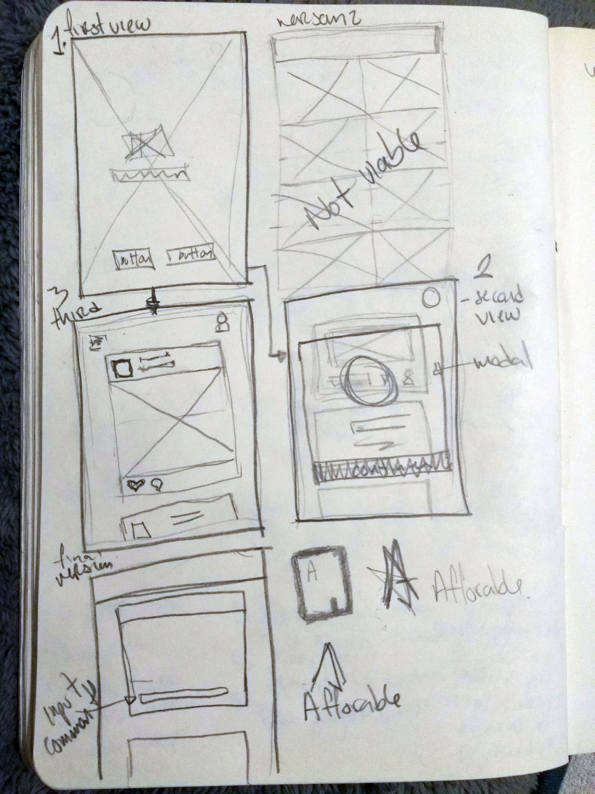

## Descripción del sketch ##
 Primera vista- Entrada a la aplicación

## Propuesta

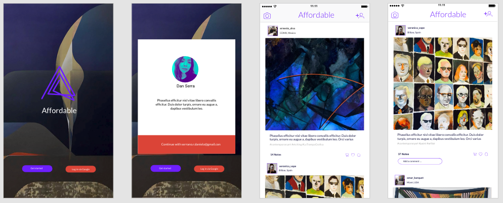

## Descripción de propuesta ##
UI
En cuanto al tipo de representación se utilizaron códigos tipográficos y de color reticentes es decir  uso mínimo de recursos con la intención de no generar ruido.  

UX
En esta propuesta se prioriza la visualización de las imágenes que muestran expresiones artisticas de los usuarios, que es el objetivo principal de la aplicación. El uso de tarjetas y la visualización continua de las publicaciones permite el flujo de información.

## Propuesta UI Elements
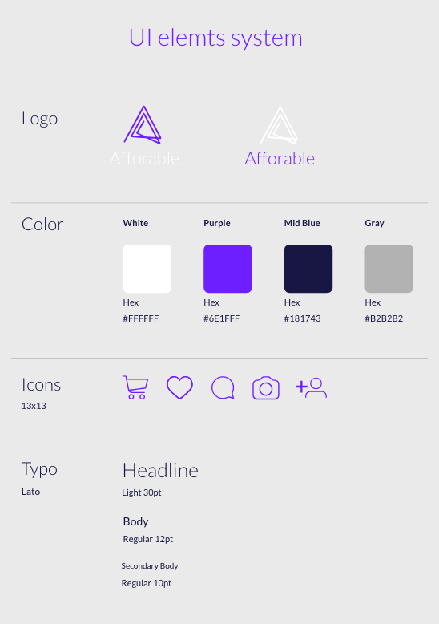
